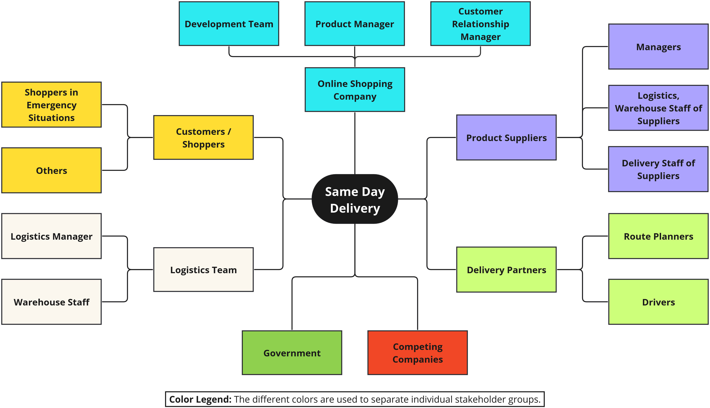

# Practice: Stakeholder Mapping

_Note:_ **This practice is not invented by us!** The Stakeholder Mapping practice has already been around for a while, several related approaches and templates have been proposed [^1][^2][^3]. 

This practice is covered here as well for the sake of completeness: if you want to create a [Value Impact Mapping](./value-impact-mapping.md) or go through the whole [Value-Driven Analysis and Design (VDAD)](./../value-driven-analysis-and-design) process, this practice can help you to identify your stakeholders first. The following instructions and explanations of this practice are however specific to the context of ethical or "value-driven" analysis goals.

## Context
A group of people, may it be managers, engineers, people who want to build a new startup company, etc., want to produce some new piece of software. They want to find out who their stakeholders are and what the impact of the system to be built is on those stakeholders. In our context here, they probably want to apply [Value Impact Mapping](./value-impact-mapping.md) and need to know the stakeholders in advance (precondition).

The following inputs (see [VDAD's Step 1](./../process/step-1-aquire-domain-understanding.md)) are helpful for this practice:

 * Knowledge about the domain of the system (for example in the form of a domain model)
 * Workflows that illustrate business processes, elicited with domain-driven practices such as Event Storming[^2] or Domain Storytelling[^3]
 * Use Cases and/or User Stories, as summarized in Design Practice Repository (DPR)[^4]
 * Already known Non-Functional Requirements (NFRs) and technical/organizational constraints
 * Additional artifacts depending on project context and needs

## Goal
The goal of this practice is not only to find stakeholders that are _directly_ affected by the system (such as users), but to identify _indirect_ stakeholders as well. Indirect stakeholders can be other organisations, the government, or individuals; anyone that will somehow be affected by the system, even when not directly using it. Literature on this topic often also refers to _visible_ (direct) vs. _invisible_ (indirect) stakeholders. As already mentioned, invisible stakeholders are human beings that are not directly involved in your project; for example, if you start a new online shopping business, invisible stakeholders could be local stores that you maybe do not know but whose business model is threatened by your new digital system.

## Procedure / Instructions
It is typically easier to start identifying visible/direct stakeholders. These can usually just be derived from the conducted functional requirements. You find them in:

 * Use Cases (Actors)
 * User Stories ("As a ..." part of stories)
 * Domain Models
 * Event Stormings / Domain Storytellings (Actors)
 * etc.

Some stakeholders might have same interests or belong to a common group of stakeholders. For example, a "product manager" and the "board of directors" could both be subordinated to a group called "management". This way, you can structure your stakeholder hierarchically and make your stakeholder map clearer and easier to read.

In a second step, chances are high that this is more tricky, you have to anticipate invisible/indirect stakeholders. It might help to:

 * Go through the complete business process; which human beings are not part of the process but still affected?
 * Which existing processes does the system or feature you are going to build change/adjust? Are there human beings that are affected by these existing processes?
 * Consult existing stakeholder classifications[^4]; these might contain stakeholder groups you haven't thought of.
 * Potentially already think about values that are affected by your system. For example by studying the overarching core values of the IEEE 7000 standard[^5]. This can help in uncovering invisible stakeholders as well.

## Notations

### Graphical Notation

There are several graphical notations (see references) available that can be created used with graphical tools such as [Miro](https://miro.com/). 

The following example uses [this template](https://miro.com/de/templates/stakeholder-map/) for Miro and allows to group the stakeholders:


### Context Mapper DSL

[Context Mapper](https://contextmapper.org/) with its Context Mapping DSL (CML) language offers a Domain-Specific Language (DSL) to model stakeholders. Context Mapper is available as a [Visual Studio Code Extension](https://contextmapper.org/docs/vs-code/), as an [Eclipse Plugin](https://contextmapper.org/docs/eclipse/), or alternatively available as [Online IDE via Gitpod](https://contextmapper.org/docs/online-ide/). With CML you can simply model stakeholders in textual form and generate the graphical diagram with its PlantUML generator. 

The following example illustrates how stakeholders and stakeholder groups can easily be modelled in CML. Checkout the [Context Mapper documentation on stakeholder modelling](https://contextmapper.org/docs/stakeholders/) for more details and complete documentation.

```cml
BoundedContext ExampleContext

Stakeholders of ExampleContext {

  StakeholderGroup Online_Shopping_Company {
    Stakeholder Development_Team {
      influence MEDIUM
      interest HIGH
    }
    Stakeholder Product_Management {
      influence HIGH
      interest HIGH
    }
    Stakeholder Customer_Relationship_Manager {
      influence HIGH
      interest MEDIUM
    }
  }

  Stakeholder Shopper {
    description "Is using the shopping system to by everday goods."
    
    influence MEDIUM
    interest HIGH
  }

}
```

## Examples
In the following, a fictitious online shop scenario is used to illustrate this practice. An existing online shopping company wants to realize a new offering for "same day delivery". Customers in emergency situations shall be able to order everyday products and get them delivered on the same day.

The team has identified visible stakeholders such as _Shoppers_, the _Development Team_ and the _Product Management_ as well as invisible stakeholders such as the _Drivers of Delivery Partners_ and _Competing Companies_. They have first visualized their stakeholders for the new shop feature vizually with [Miro](https://miro.com):



Alternatively, the team tried to model the same outcome in the Context Mapper DSL as introduced above. By using Context Mappers's PlantUML generator, it is possible to generate the [Stakeholder Map](./../practices/stakeholder-mapping.md) automatically:


The Freemarker template used by Context Mapper is publicly available, just like the source code of the tool. Therefore, it is possible to extend it according to individual preferences and projects needs (just in case you miss the colors used in the previous example). 

## Tools
Stakeholders can be documented with various tools:

 * Visual tools such as [Miro](https://miro.com)
 * [Context Mapper's features supporting VDAD](https://contextmapper.org/docs/vdad-support)
 * Textual editors

## Related Practices
Stakeholder Mapping is a well-known practice and promoted by several tools[^1][^2][^3]. Additionally, the practice of identifying stakeholders is of course part of other ethical approaches in engineering as well, such as the IEEE 7000 standard[^5] or Value-Based Engineering[^6]. These standards and books might further help and contain more detailed advice in case you want to dig deeper. Our practice [Value Impact Mapping (VIM)](value-impact-mapping.md) is related as it needs stakeholders as well and is part of the subsequent VDAD step; Stakeholder Mapping supports [Step 2](./../process/step-2-identify-stakeholders.md), while [Value Impact Mapping (VIM)](value-impact-mapping.md) can be used for [Step 3](./../process/step-3-identify-values-per-stakeholder.md).


[^1]: <https://www.mural.co/blog/stakeholder-mapping>
[^2]: <https://miro.com/blog/stakeholder-mapping/>
[^3]: <https://simplystakeholders.com/stakeholder-mapping/>
[^4]: _Ethics in Software Engineering: A Systematic Literature Review_, Razieh Alidoosti, Patricia Lago, Maryam Razavian, Antony Tang, <https://hdl.handle.net/1871.1/6babced3-4bd2-443e-8c1b-b0593a4cb6e1>
[^5]: IEEE Standard Model Process for Addressing Ethical Concerns during System Design, 2021, <https://ieeexplore.ieee.org/document/9536679> 
[^6]: Value-Based Engineering - A Guide to Building Ethical Technology for Humanity, Sarah Spiekermann, 2023, <https://doi.org/10.1515/9783110793383>
