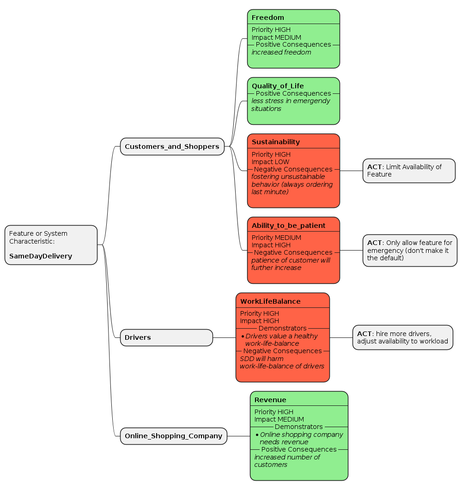

# Practice: Value Impact Mapping

_Hint:_ This practice is inspired by the more general planning technique [Impact Mapping](https://www.impactmapping.org/). We adjusted it specifically for the needs of identifying positive and negative impact on human being's values.

## Context
There are varying starting positions from which a group of people might want to think about the impact of some piece of technology they are aiming to build. Such starting positions can be:

 * A group of people, technical (engineers) or not, who want to found a startup company and build a new software product.
 * A technology company that considers building a new product.
 * A software development team that has to implement a new feature for an existing product.

Value Impact Mapping (VIM) is eligible whenever some technology like software, that is used by people and has impact on people, shall be created or adjusted.

_Precondition:_ We assume that the direct and indirect stakeholders of the system or feature to be built have already been identified. If this is not the case, a stakeholder analysis should be conducted, for instance leveraging the [Stakeholder Mapping](./stakeholder-mapping.md) practice.

## Goal
The goal of this practice is to identify all stakeholder's values that might be affected by the system or feature. The impact on such values might be positive, neutral, or negative. Examples for ethical values applicable to system design are _autonomy_, _fairness_, _privacy_, _respect_, etc. Systems can promote or harm such values for stakeholders. For a deeper understanding regarding what values are, have a look at the IEEE 7000 Standard[^1] or the introduction video [What are Values](https://www.youtube.com/watch?v=aYqCmmkrguI) by Sarah Spiekermann. A set of common ethical values is provided in Annex G of IEEE 7000, which is positioned as suggestive but not normative.

In addition to identifying the values, a goal of this practice is to find potential mitigation actions for negatively impacted values.

## Procedure / Instructions

*First, "what" and "which "questions have to be answered:*

### Identify values per stakeholder, and the positive and negative impact of the system or feature on these values.

Ask the following questions _for each_ stakeholder in order to identify their values and the impact of the system or feature towards those values:
 
 * Which benefits does the system provide for the individual stakeholder if the system were implemented at scale?
 * Which harms could be caused for the individual stakeholder if the system were implemented at scale?
 * What are the negative implications of the system or feature for the character and personality of the individual stakeholder?
 * Which values and virtues would you consider as so important in terms of your personal maxims that you would want their protection to be recognized as a universal law and that should therefore be respected by the system or feature?

_References:_ These questions come from the IEEE 7000 Standard[^1] and Value-Based Engineering (VBE)[^2]; they are based on the three ethical frameworks _virtue ethics_, _duty ethics_, and _utilitarianism_.

Ideally, you answer the questions and identify the values together with stakeholder representatives. Conduct interviews with them and find out what is important to them. In case a direct conversation is not possible, you could create Personas.

The Proctive Consider, Analyze, Review, Evaluate (CARE) framework[^3] and Software Development Impact Statements (SoDIS)[^4] as well as the Consequence Scanning[^5] also provide questions to ask when prioritizing values and assessing impact.

*In a second step, "how" questions look at dealing with values and their impact:* 

### Find potential improvements to the system that reduce harm (mitigation actions).

For each harmed value identified in the previous step, think about whether there could be mitigation actions.

 * Are there possible adjustments and/or extensions to the feature or system characteristic that can be implemented so that the respecting value is less harmed?
 * Are there parts of the feature or system that maybe should not be built?

Together with your stakeholders, try to find adjusted solutions that still fulfill your (non-)functional requirements, but do not harm the identified values as much as the solution you had in mind before. This can also mean that you agree that some features should not be implemented.

## Notations

### Graphical Notation

Inspired by the [Impact Mapping](https://www.impactmapping.org/) practice, we suggest to use a mind map, structured into four levels (feature-stakeholder-values-actions):


The four levels are:

 1. The *feature* or system characteristic you want to analyze.
 2. The impacted *stakeholders*.
 3. The *values* of the individual stakeholders; including an indication whether the value is fostered or harmed.
 4. Mitigation *actions* which can be taken in order to reduce harm.

You can create Value Impact Maps physically on the whiteboard or with any graphical tool that supports mind maps. For example, [Miro](https://miro.com) provides a template: [Miro Impact Mapping template](https://miro.com/templates/impact-mapping/).

### Context Mapper DSL

[Context Mapper](https://contextmapper.org/) with its Context Mapping DSL (CML) language offers a Domain-Specific Language (DSL) to model stakeholders and their values. Context Mapper is available as a [Visual Studio Code Extension](https://contextmapper.org/docs/vs-code/), as an [Eclipse Plugin](https://contextmapper.org/docs/eclipse/), or alternatively available as [Online IDE via Gitpod](https://contextmapper.org/docs/online-ide/). With CML you can simply model stakeholders and value registers in textual form and then generate a Value Impact Map with its PlantUML generator automatically. 

The following example illustrates how values in value registers[^1] can easily be modelled in CML. Checkout the [Context Mapper documentation on value register modeling](https://contextmapper.org/docs/value-registers/) for more details and complete documentation.

```cml
BoundedContext SameDayDelivery

Stakeholders of SameDayDelivery {
  StakeholderGroup Customers_and_Shoppers
  StakeholderGroup Delivery_Staff_of_Suppliers
}

ValueRegister SD_Values for SameDayDelivery {  
  Value Freedom {
      Stakeholder Customers_and_Shoppers {
        priority HIGH
        impact MEDIUM
        consequences
          good "increased freedom"
      }
      Stakeholder Delivery_Staff_of_Suppliers {
        priority HIGH
        impact HIGH
        consequences
          bad "work-life-balance"
      }
    }
}
```

## Example

To illustrate this practice, we use a fictitious online shop scenario. An existing online shopping company wants to realize a new offering for "same day delivery". Customers in emergency situations shall be able to order everyday products and get them delivered on the same day.

The company already identified the stakeholder groups and stakeholders by creating a [Stakeholder Map](./stakeholder-mapping.md):


Now, they elicit the values of these stakeholders and identify benefits and harms towards those values. The following exemplary Value Impact Map is not complete (it does not cover all stakeholders); it shall just illustrate how such a map could look like.

The team identified the following benefits and harms (top-down order as in the map below): 


 * The feature might **increase the freedom for shoppers** in certain cases; they do not need to leave their home and rush to a shop in an emergency scenario (imagine you have your kids at home and cannot easy leave but need an every day article urgently).
 * The feature **harms sustainability**, potentially in multiple forms:
   * More delivery trucks will have to be on the road in order to implement this feature (**environmental** sustainability).
   * If customers get used to the feature, they will potentially start using it for non-emergency cases as well and get used to not leaving the house at all. Social interactions are reduced, etc. (sustainability in terms of **physical as well as psychological health**).
 * A benefit of the feature, according to the management, shall be the fact that **"quality of life" is increased** in such emergency situations. The feature shall **reduce stress** for the human being in the emergency.
 * On the other hand, the feature potentially **harms the patience** of customers. A development of our society today is that everything goes faster and faster ... The same day delivery feature fosters that development. Once used to getting an article delivered on the same day, people might get more annoyed if this is not the case (changed expectations).
 * For the delivery staff this feature could lead to increased workload, new working shifts, and therefore **harmed work-life balance**.
 * The online shop company wants to have the feature because the expect **benefits in revenue** as it will attract more customers.

*Note:* This list does not claim to be complete; you might come up with other benefits and harms for this specific scenario.

Once the company identified the values (column 3 in Value Impact Map above), they added mitigation actions that could reduce the harm to some values:

 * Harm to sustainability could be reduced by **limiting the availability** of the feature. Same day delivery could for example only be available for certain products or only in case it would not mean one single truck driving for just that single article.
 * The feature could be **optional and not the "default"**. With the price of this delivery, the company could ensure that users not use it every time - but just in emergency situations (setting the right incentives).
 * If the delivery stuff is no longer able to handle orders, the system could temporarily disable the feature in order to **protect employees work-life balance**.
 * etc.

Again, this list of mitigation actions is not complete. You might come up with others.

Alternatively, the values could have been modeled with the [Context Mapper](https://contextmapper.org) CML language, as introduced above. With its PlantUML generator, the Value Impact Map would be automatically generated as follows:



## Tools
Value Impact Maps can be created with various tools:

 * Graphical tools that support mind mapping; such as [Miro](https://miro.com).
 * Context Mapper with its ability to [model stakeholders and values](/docs/vdad-support/) and then generate a Value Impact Map automatically.

## Related Practices

There are alternative and related practices/techniques to achieve the goal of producing valuable, ethically responsible software:

 * The IEEE 7000 standard[^1] offers an extensive process that goes way deeper into the topic. It is however not that "lightweight" as our suggested approaches or as ESE (see next bullet).
 * [Ethical Software Engineering (ESE)](https://github.com/ethical-se/ese-practices) applies the IEEE 7000 standard to agile practices. For example, the practice [Story Valuation](https://github.com/ethical-se/ese-practices/blob/main/practices/ESE-StoryValuation.md) can be seen as alternative approach to Value Impact Mapping that is applied to User Stories.
 * Value-Based Engineering[^2] by Sarah Spiekermann is another interesting approach which also inspired us and has many similarities to the IEEE 7000 standard.

Our [Stakeholder Mapping](stakeholder-mapping.md) practice is of course related as well, as both require stakeholders and are used in subsequent steps of the VDAD process; Stakeholder Mapping supports [Step 2](./../process/step-2-identify-stakeholders.md), while [Value Impact Mapping (VIM)](value-impact-mapping.md) can be used for [Step 3](./../process/step-3-identify-values-per-stakeholder.md).


[^1]: IEEE Standard Model Process for Addressing Ethical Concerns during System Design, 2021, <https://ieeexplore.ieee.org/document/9536679>
[^2]: Value-Based Engineering - A Guide to Building Ethical Technology for Humanity, Sarah Spiekermann, 2023, <https://doi.org/10.1515/9783110793383>
[^3]: Proctive Consider, Analyze, Review, Evaluate (CARE), <https://ethics.acm.org/wp-content/uploads/2021/03/Proactive-CARE-for-Computing-Professionals.pdf>
[^4]: Software Development Impact Statements (SoDIS), <https://doi.org/10.17705/1CAIS.01540>
[^5]: Consequence Scanning, <https://doteveryone.org.uk/project/consequence-scanning/>
