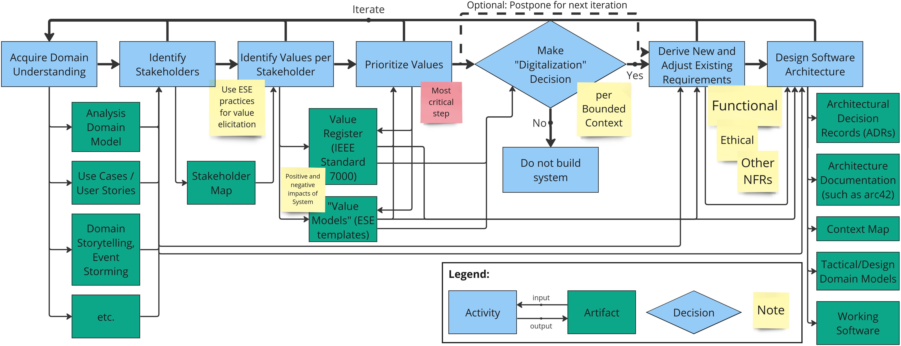

# Value-Driven Analysis and Design (VDAD) Process Overview

VDAD, first presented at EuroPLoP 2024[^3], combines value-driven approaches with analysis and design practices in software engineering; we especially aim at bringing ethical thinking into domain-driven practices. As software engineers, we should build digitalized solutions that serve humanity - never the other way around. VDAD proposes seven steps that cover the whole development lifecycle and aim at illustrating how human and ethical values can be respected in all phases of the software development process.

The seven steps are:

 * **Step 1:** [Aquire Domain Understanding](./step-1-aquire-domain-understanding.md)
 * **Step 2:** [Identify Stakeholders](./step-2-identify-stakeholders.md)
 * **Step 3:** [Identify Values per Stakeholder](./step-3-identify-values-per-stakeholder.md)
 * **Step 4:** [Prioritize Values](./step-4-prioritize-values.md)
 * **Step 5:** [Make Digitalization Decision](./step-5-make-digitalization-decision.md)
 * **Step 6:** [Derive New and Adjust Existing Requirements](./step-6-derive-new-and-adjust-existing-requirements.md)
 * **Step 7:** [Design Software Architecture](./step-7-design-software-architecture.md)

*Note:* The VDAD process is not considered to be conducted in a linear, unidirectional way. Project teams have to iterate over the individual steps as well as the whole process. The page [process continuation](step-infinity-process-continuation.md) explains this incremental approach.

The following illustration visualizes the VDAD process with its steps as well as the input and output artifacts of the individual steps.

_Note:_ Each step with its inputs and outputs is elaborated in detail on the corresponding pages linked above.

## Domain-Driven Practices and Collaborative Modelling as Enablers
All value-driven approaches and processes that aim at treating values as first-class citizens (such as the IEEE-7000[^2] or Value-Based Engineering[^1]) require close and interdisciplinary collaboration between all stakeholders and human beings affected by a system.

One important goal of Domain-Driven Design (DDD) and Collaborative Modelling approaches (such as Event Storming, Domain Storytelling, etc.) is to find a common understanding and a ubiquitous language between engineers, domain experts, and any other stakeholders. Therefore, these practices and methods can help us in applying value-based engineering and establish the required communication between all human being involved in the process.

Modelling in general can help us to visualize the context of a system, interrelations between stakeholders and values, and conflicts that should be identified so that they can, hopefully, be solved.

## Overview of Practices and Tools
The following overview lists all practices and artifacts that support you in the individual VDAD steps:

| VDAD Step                                               | Practices and Artifacts |
|---------------------------------------------------------|-------------------------|
| **Step 1**: Aquire Domain Understanding                 | Use Cases, User Stories, Business Process Models, Domain Models (e.g. with [Context Mapper](https://contextmapper.org)) based on Domain-Driven Design (DDD) patterns, [Collaborative Modelling](https://www.wps.de/aktuelles/collaborative-modelling) (e.g. Event Storming, Domain Storytelling) <!-- there is an EN version of the WPS page, less complete: https://www.wps.de/en/news/collaborative-modelling --> |
| **Step 2**: Identify Stakeholders                       | [Stakeholder Mapping](./../practices/stakeholder-mapping.md), Personas, Identify them in the artifacts produced in _Step 1_ (Use Cases, User Stories, etc.), Context Mapper DSL (CML) stakeholder model |
| **Step 3**: Identify Values per Stakeholder             | [Stakeholder Mapping](./../practices/stakeholder-mapping.md) and [Value Impact Mapping (VIM)](./../practices/value-impact-mapping.md), Value Register[^2], [ESE](https://github.com/ethical-se/ese-practices) templates to model values, Context Mapper DSL (CML) value model |
| **Step 4**: Prioritize Values                           | Value Register[^2], templates suggested in [ESE Story Valuation](https://github.com/ethical-se/ese-practices/blob/main/practices/ESE-StoryValuation.md), Context Mapper DSL (CML) value model with stakeholder priorities |
| **Step 5**: Make Digitalization Decision                | _All inputs from steps before_ |
| **Step 6**: Derive New and Adjust Existing Requirements | Use models and knowledge from previous steps to elicit and/or refine functional and non-functional requirements; formulate so-called Ethical Value Requirement (EVRs) according IEEE 7000 standard[^2], apply [ESE Story Valuation](https://github.com/ethical-se/ese-practices/blob/main/practices/ESE-StoryValuation.md) to create EVRs |
| **Step 7**: Design Software Architecture                | [Architecture Decision Records (ADRs)](https://adr.github.io/), architecture documentation (e.g. filled-out [arc42](https://www.arc42.de/) template), <!-- DPR links? --> Strategic and Tactic DDD (i.e., Bounded Contexts and Domain Models with Aggregates, Entities and other DDD patterns); use [Context Mapper](https://contextmapper.org) for modelling) for architecture and design, working software |

[^1]: <https://www.value-based-engineering.com/>
[^2]: IEEE Standard Model Process for Addressing Ethical Concerns during System Design, 2021, <https://ieeexplore.ieee.org/document/9536679>
[^3]: _Published EuroPLoP paper coming soon ..._
