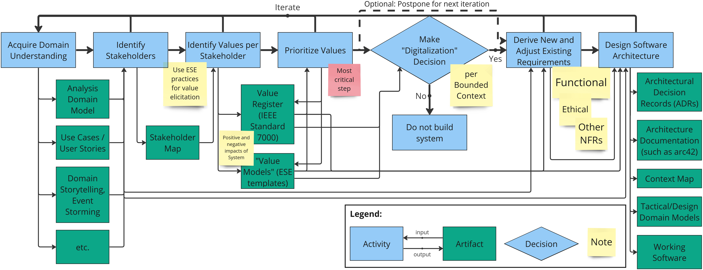

# Process Continuation

_TL;DR:_ Iterate over Steps 1 to 7.

## Iterate over Steps and Process

As indicated in the following process illustration, neither the individual steps nor the entire VDAD process should be conducted a linear, unidirectional way. 

It is necessary to iterate over the individual steps and the process as a whole in order to evolve the produced artifacts in each step. Each step may yield new insights that are relevant for subsequent steps. For example, while stakeholders of different kinds learn about domain context, requirements, and system capabilities, they might want to reprioritize and/or elicit additional values.

Steps might further have bidirectional dependencies. For instance, while understanding the domain, new stakeholders might be found. An analysis of these stakeholders might bring new insights about the domain (Steps 1 and 2).

## Process Navigation

 * [Overview](README.md)
 * [Step 1: Aquire Domain Understanding](step-1-aquire-domain-understanding.md)
 * [Step 2: Identify Stakeholders](step-2-identify-stakeholders.md)
 * [Step 3: Identify Values per Stakeholder](step-3-identify-values-per-stakeholder.md)
 * [Step 4: Prioritize Values](step-4-prioritize-values.md)
 * [Step 5: Make Digitalization Decision](step-5-make-digitalization-decision.md)
 * [Step 6: Derive New and Adjust Existing Requirements](step-6-derive-new-and-adjust-existing-requirements.md)
 * [Step 7: Design Software Architecture](step-7-design-software-architecture.md)
